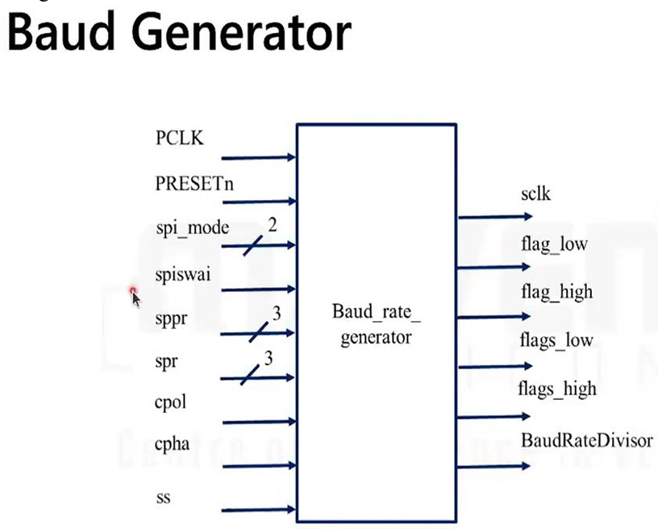
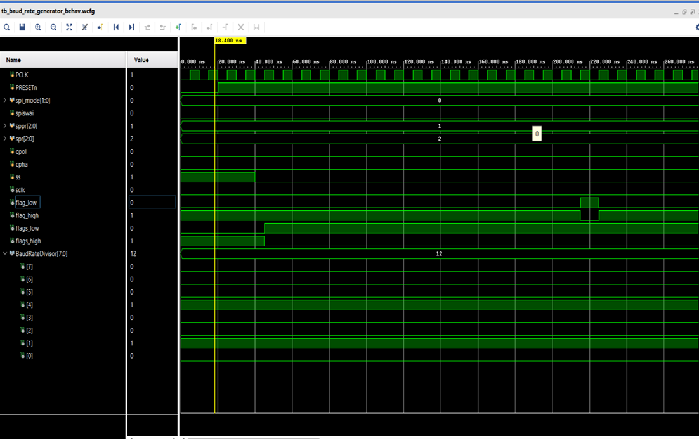
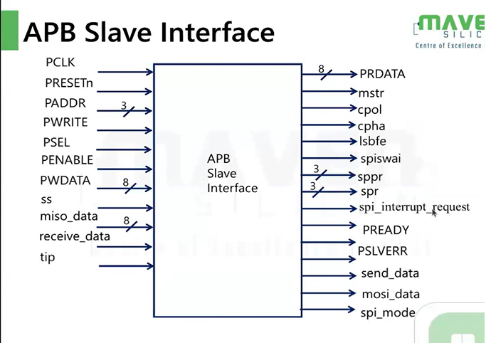
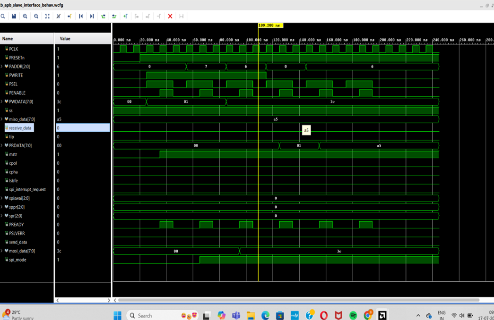
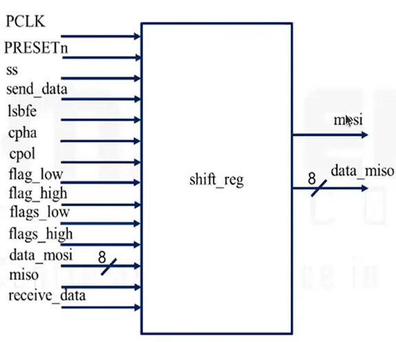
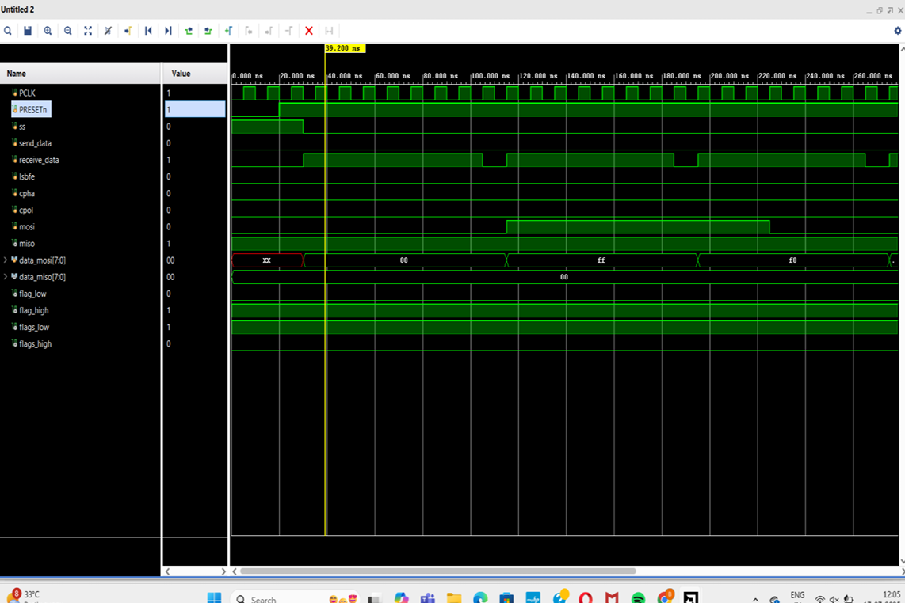
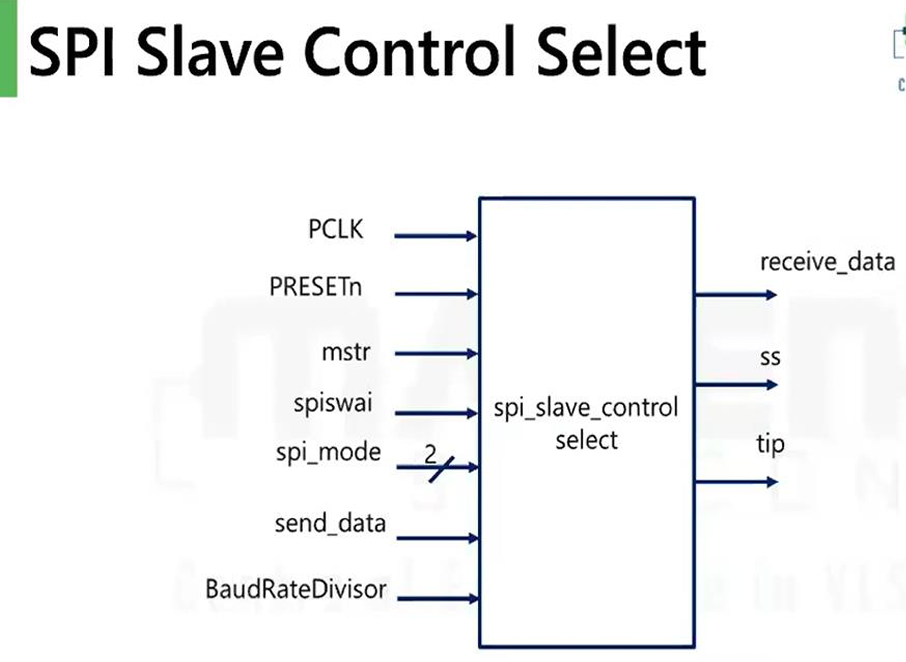
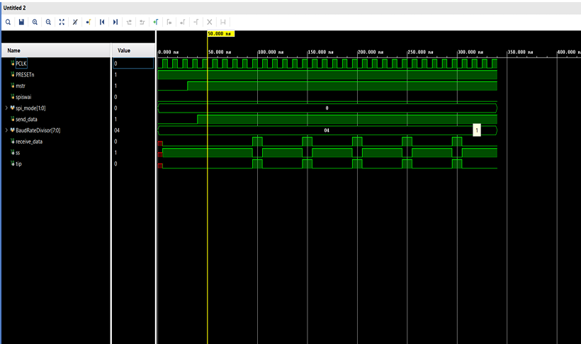
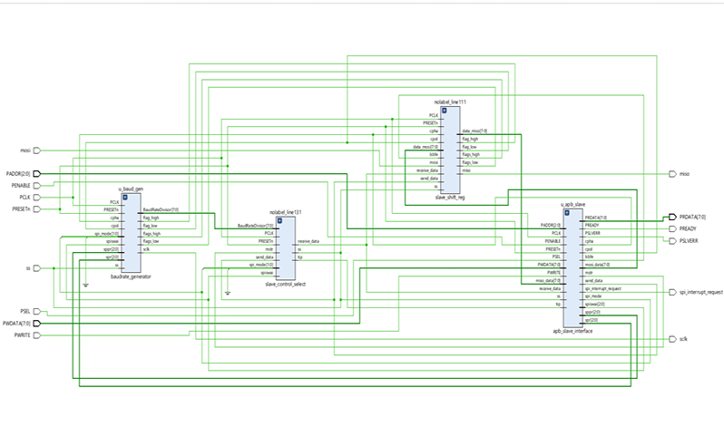

# APB-based-on-SPI
## INTRODUCTION: 

APB-based SPI is a peripheral design in which an SPI controller is connected to a processor through the AMBA APB (Advanced Peripheral Bus). It lets software configure and use SPI devices—such as sensors, ADCs, displays, EEPROMs, and flash memory—by reading from and writing to memory-mapped APB registers.
This APB-based SPI design works like a small communication unit between a processor and an external SPI device.

SPI, or Serial Peripheral Interface, is a synchronous serial communication protocol that commonly uses four signals:
- SCLK: serial clock generated by the master
- MOSI: master-out, slave-in data
- MISO: master-in, slave-out data
- SS/CS: slave-select or chip-select
  
In an APB-based SPI controller, the processor acts as the APB master and the SPI controller acts as an APB slave. The processor writes configuration values through APB—for example, clock-divider settings, SPI mode, data length, and chip-select selection. It then writes transmit data into a transmit register or FIFO. The SPI controller converts that parallel register data into serial bits and sends them through MOSI while generating SCLK and asserting the selected CS line. At the same time, incoming MISO data is shifted into a receive register or FIFO, where the processor can read it using APB.

APB is well suited to this purpose because it is a simple, low-power bus intended for peripherals with modest bandwidth requirements. A typical APB transaction has a setup phase, where address and control signals are placed on the bus, followed by an access phase, where the transfer completes when PREADY is asserted. The main APB signals used by an SPI peripheral include PADDR, PSEL, PENABLE, PWRITE, PWDATA, PRDATA, PREADY, and PSLVERR.

## Typical APB SPI register blocks include: 

**APB Slave Interface:**  Receives APB signals such as PCLK, PRESETn, PADDR, PWRITE, PSEL, PENABLE, and PWDATA. It decodes addresses, accepts writes, returns read data through PRDATA, and generates PREADY and PSLVERR.

**Baud-rate generator:** Divides PCLK to produce the required SPI serial clock, SCLK. It may create timing flags such as flag_low, flag_high, flags_low, and flags_high for clock generation and data sampling.

**SPI_Shift register:** Performs serial-to-parallel and parallel-to-serial conversion. It takes transmit data from the APB side, shifts it out through MOSI, samples incoming MISO data, and produces received data.

**SPI_slave-control selector:** Controls the SS/chip-select signal for the selected external SPI slave. It coordinates chip-select timing with the active SPI transfer.

## Architecture(A top module):

The processor communicates with the SPI controller using the APB bus. Through APB, it sends settings such as SPI mode, clock speed, slave selection, and data to transmit. It can also read received data and check whether a transfer is complete.

The APB Slave Interface is the entry point of the design. It receives APB signals from the processor, understands whether the processor wants to read or write, and sends the required control signals to the internal SPI blocks.

The baud-rate divider generates the SPI clock, called SCLK. Since the processor clock (PCLK) is usually faster than the required SPI clock, this block divides PCLK to create a slower clock suitable for the SPI device.

The shift register is the main data-transfer block. When the processor writes data, the shift register converts the parallel data into serial bits and sends them one by one on the MOSI line. At the same time, it receives serial bits from the external device through the MISO line and stores them as received data.

The SPI slave-control selector chooses which external SPI device should communicate with the controller. It activates the corresponding SS or chip-select signal. Only the selected slave responds to the clock and data signals.

During a transfer, the controller keeps SS active, generates SCLK, sends bits on MOSI, and receives bits on MISO. After all bits are transferred, it stops the clock, releases SS, and sets the transfer-complete status (tip becomes inactive). The processor can then read the received data through APB.
So, in simple terms: APB gives commands, the clock-divider creates the SPI clock, the shift register moves data, and the slave-control block selects the SPI device.

## 1.BAUDRATE_GENERATOR:

The Baud Rate Generator is used to generate the SPI serial clock (SCLK) from the system clock (PCLK). Since PCLK is usually much faster than the clock required by an SPI device, this block divides the system clock according to the programmed baud-rate settings.
The baud rate is controlled using the SPPR and SPR inputs. These values decide the clock division factor and therefore determine the speed of SCLK. A larger division value produces a slower SPI clock, while a smaller division value produces a faster SPI clock.

The spi_mode, CPOL, and CPHA inputs decide the clock behavior. CPOL defines the idle level of SCLK: low when CPOL = 0 and high when CPOL = 1. CPHA defines whether data is sampled on the first clock edge or the second clock edge. Thus, the baud-rate generator produces an SPI clock compatible with the selected SPI mode.
The SS signal indicates that an SPI slave is selected. The baud generator produces clock pulses only when a transfer is active and the slave is selected. PRESETn resets the block, while PCLK provides its operating clock.

Along with SCLK, the block generates timing flags such as flag_low, flag_high, flags_low, and flags_high. These flags help other blocks, especially the shift register, know when to transmit a bit, sample received data, or complete a transfer. The BaudRateDivisor output represents the calculated division value used to generate the SPI clock.

OUTPUT:

## 2. APB_SLAVE_INTERFACE:

The APB Slave Interface connects the processor’s APB bus to the SPI controller. It receives read and write requests from the processor and converts them into control signals for the internal SPI blocks.

The input signals PCLK and PRESETn provide the clock and reset for the interface. PADDR selects the SPI register address, while PWRITE indicates whether the processor is performing a write operation or a read operation. PSEL selects the SPI peripheral, and PENABLE indicates the APB access phase. PWDATA carries the data written by the processor.

When the processor writes to the SPI controller, the APB Slave Interface stores the required configuration values and generates signals such as:

- mstr to select master mode
  
- cpol and cpha to select the SPI clock mode
  
- lsbfe to choose LSB-first or MSB-first transmission
- spiswai for SPI control
- sppr and spr to set the SPI baud rate
- spi_mode to select the SPI operating mode
- send_data and mosi_data to provide transmit data.
- 
The interface also receives information from the SPI data path. miso_data carries data received from the external SPI slave, receive_data contains the completed received byte, and tip indicates that an SPI transfer is in progress.

During an APB read operation, the interface sends the requested data back to the processor through PRDATA. For example, the processor can read received SPI data or check transfer status. PREADY indicates that the APB transfer is complete, while PSLVERR indicates an invalid or failed APB access.
The spi_interrupt_request output is used to notify the processor about important SPI events, such as transfer completion or received data availability.

OUTPUT:

## SHIFT_REG:

The shift register is the main data-transfer block of the SPI controller. Its function is to convert parallel data into serial data for transmission and convert received serial data back into parallel form.
The send_data input contains the data that must be transmitted to the SPI slave. When a transfer begins and the slave-select signal ss becomes active, this data is loaded into the shift register. The register then shifts one bit at a time and sends it through the MOSI output.

At the same time, the shift register receives serial bits from the SPI slave through the MISO input. On every valid sampling clock edge, one incoming bit is shifted into the register. After eight clock cycles, the complete 8-bit received value is available at the data_miso output.

The data_mosi input may contain the parallel transmit byte provided by the APB interface, while the mosi output carries its serial form to the external slave. The receive_data input/output path is used to store or report the received byte.

The lsbfe signal selects the data order:
- When lsbfe = 0, data is transmitted MSB first.
- 
- When lsbfe = 1, data is transmitted LSB first.
- 
The clock-control signals cpol and cpha decide the timing of transmission and sampling. CPOL sets the idle state of the SPI clock, while CPHA decides whether data is changed or sampled on the first or second clock edge.
The timing signals flag_low, flag_high, flags_low, and flags_high are generated by the baud-rate generator. They tell the shift register when to shift out the next MOSI bit and when to sample the next MISO bit. PCLK is the internal clock, and PRESETn resets the shift register.

OUTPUT:

## SPI_SLAVE_CONTROL_SELECT :

The SPI Slave Control Select block manages the SPI transfer and controls the slave-select signal, SS. Its main purpose is to select the required SPI slave device, start the transfer, monitor its progress, and indicate when the transfer is complete.
The block operates using PCLK and is reset using PRESETn. The mstr input determines whether the controller works in master mode. In master mode, the controller generates the clock and controls the SS signal for the external SPI slave.

The spi_mode input selects the SPI operating mode. It may define how the controller handles communication and slave selection. The spiswai signal controls SPI behavior during special conditions such as wait or stop operation.
When valid send_data is available, the SPI Slave Control Select block begins a transfer. It activates the SS signal, which selects the external SPI slave. Normally, SS is active low, so the selected device is enabled when SS = 0.

The BaudRateDivisor input represents the selected clock-division value. It is used to determine the speed of the SPI transfer. Based on this setting, the controller allows the baud-rate generator and shift register to perform the data transmission.

During the transfer, the block sets the tip signal high. tip means Transfer In Progress. It remains high while data bits are being sent on MOSI and received on MISO. Once the complete data word has been transferred, the block deactivates SS, clears tip, and makes the received byte available through receive_data.

OUTPUT:

## CONCLUSION:

The APB-based SPI controller was successfully designed to provide reliable communication between an APB processor bus and external SPI devices. The design includes an APB Slave Interface for processor access, a Baud Rate Generator for creating the SPI clock, a Shift Register for serial data transmission and reception, and an SPI Slave Control Select block for managing chip select and transfer status.

The controller supports configurable SPI parameters such as clock polarity (CPOL), clock phase (CPHA), baud rate, master mode, and bit transmission order. Through APB register read/write operations, the processor can configure the SPI controller, send data, receive data, and monitor transfer completion.

Overall, the project demonstrates a simple, modular, and efficient SPI peripheral architecture suitable for integration into System-on-Chip designs.

