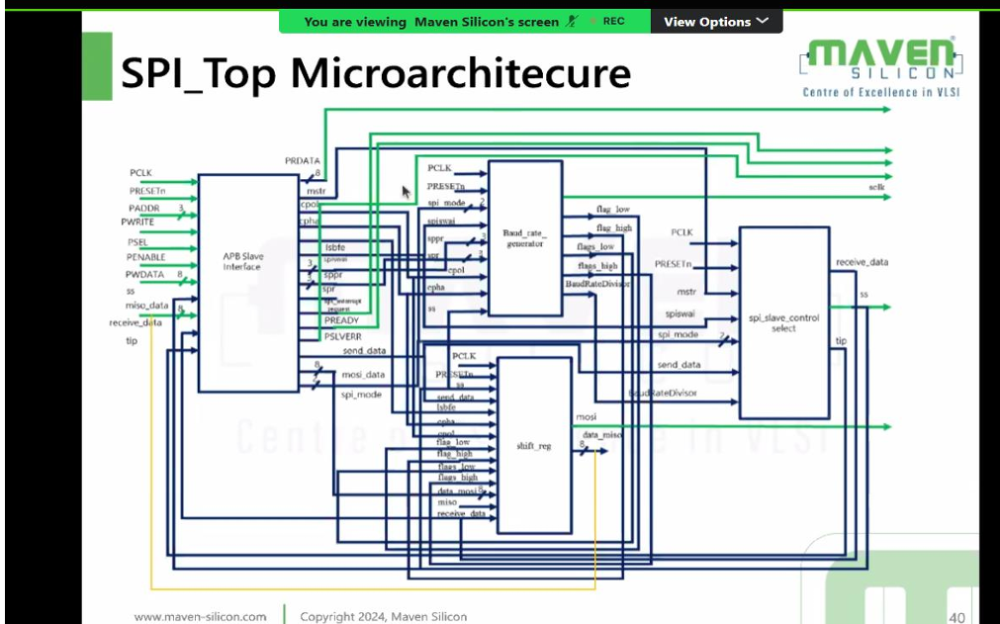

# APB-based-on-SPI
## INTRODUTCTION 

APB-based SPI is a peripheral design in which an SPI controller is connected to a processor through the AMBA APB (Advanced Peripheral Bus). It lets software configure and use SPI devices—such as sensors, ADCs, displays, EEPROMs, and flash memory—by reading from and writing to memory-mapped APB registers.

SPI, or Serial Peripheral Interface, is a synchronous serial communication protocol that commonly uses four signals:
- SCLK: serial clock generated by the master
- MOSI: master-out, slave-in data
- MISO: master-in, slave-out data
- SS/CS: slave-select or chip-select
  
In an APB-based SPI controller, the processor acts as the APB master and the SPI controller acts as an APB slave. The processor writes configuration values through APB—for example, clock-divider settings, SPI mode, data length, and chip-select selection. It then writes transmit data into a transmit register or FIFO. The SPI controller converts that parallel register data into serial bits and sends them through MOSI while generating SCLK and asserting the selected CS line. At the same time, incoming MISO data is shifted into a receive register or FIFO, where the processor can read it using APB.

APB is well suited to this purpose because it is a simple, low-power bus intended for peripherals with modest bandwidth requirements. A typical APB transaction has a setup phase, where address and control signals are placed on the bus, followed by an access phase, where the transfer completes when PREADY is asserted. The main APB signals used by an SPI peripheral include PADDR, PSEL, PENABLE, PWRITE, PWDATA, PRDATA, PREADY, and PSLVERR.

## Typical APB SPI register blocks include: 

**APB Slave Interface:**  Receives APB signals such as PCLK, PRESETn, PADDR, PWRITE, PSEL, PENABLE, and PWDATA. It decodes addresses, accepts writes, returns read data through PRDATA, and generates PREADY and PSLVERR.

**Baud-rate generator:** Divides PCLK to produce the required SPI serial clock, SCLK. It may create timing flags such as flag_low, flag_high, flags_low, and flags_high for clock generation and data sampling.

**SPI_Shift register:** Performs serial-to-parallel and parallel-to-serial conversion. It takes transmit data from the APB side, shifts it out through MOSI, samples incoming MISO data, and produces received data.

**SPI_slave-control selector:** Controls the SS/chip-select signal for the selected external SPI slave. It coordinates chip-select timing with the active SPI transfer.

## Architecture(A top module):

